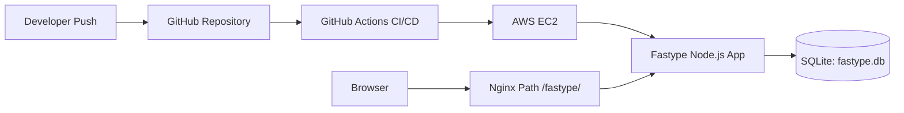
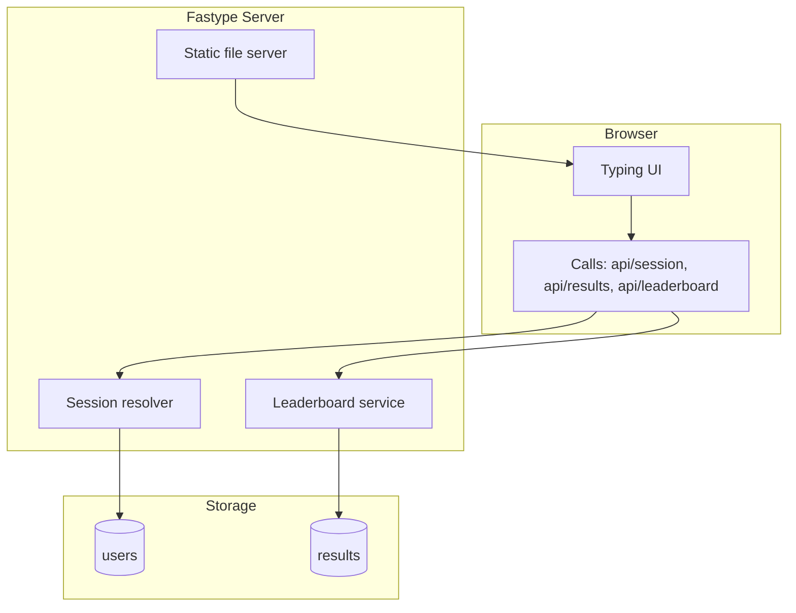

# Fastype Architecture

## Runtime Components

## Data Lifetime

- **Session window:** 24 hours (cookie + IP fallback).
- **Leaderboard window:** rolling 24 hours, top 20 users (best score per user).
- **Expiry:** stale results are deleted during API requests.
